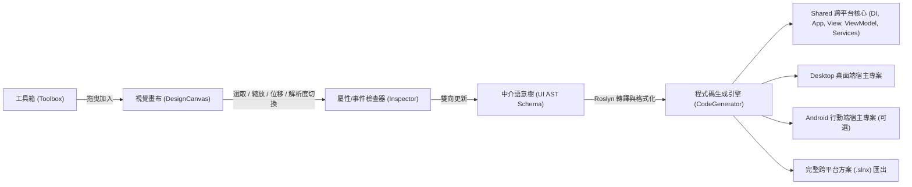

# Avalonia Form Generator (AFG)

> **視覺化拖曳式 Avalonia MVVM 介面與宣告式純 C# 程式碼生成工具**  
> 基於 **.NET 10**、**C# 14**、**Avalonia 11/12**、**Microsoft.Extensions.DependencyInjection**、**CommunityToolkit.Mvvm** 與 **Microsoft.CodeAnalysis (Roslyn)** 打造。

---

## 專案簡介 (Overview)

Avalonia UI 具備強大的跨平台特性與現代化的宣告式 UI 架構，但在傳統開發流程中缺乏直覺的「所見即所得 (WYSIWYG)」視覺化拖曳設計器。

**Avalonia Form Generator (AFG)** 旨在解決快速原型開發與表單密集型系統（如 CRUD 管理後台、行動端跨平台介面）的痛點，提供直覺的畫布拖曳、8 點縮放與智慧吸附輔助線，並將畫布操作同步至**中介語意樹 (UI Metadata AST)**，最終轉譯為**乾淨宣告式的純 C# Markup View**、**相依性注入 (DI) 架構** 與符合 **CommunityToolkit.Mvvm** 規範的 ViewModel 程式碼。



---

## 支援控制項與版面配置清單 (Supported Controls & Containers)

| 分類 | 支援項目 | 說明 |
| :--- | :--- | :--- |
| **基礎控制項** | `Button`, `TextBox`, `TextBlock`, `CheckBox`, `RadioButton`, `ComboBox`, `DatePicker`, `Slider`, `ProgressBar` | 支援完整幾何、外觀、雙向/單向資料綁定與命令事件轉換 |
| **版面配置容器** | `Canvas`, `StackPanel`, `Grid`, `Border`, `DockPanel`, `WrapPanel`, `ScrollViewer` | 支援巢狀拖曳放入、自動流式排版、列/欄定義與視覺樹精準選取 |
| **非視覺 / 硬體元件** | `DispatcherTimer`, `BackgroundWorker`, `BluetoothClient`, `SerialPortService` | 自動註冊為 Singleton / Transient DI 服務並提供專屬識別標籤 |

---

## 全域快捷鍵一覽 (Global Shortcuts)

| 快捷鍵 | 功能 | 說明 |
| :--- | :--- | :--- |
| `Ctrl + Z` | 復原 (Undo) | 一步復原完整拖曳位移、縮放、屬性修改或節點增刪 |
| `Ctrl + Y` / `Ctrl + Shift + Z` | 重做 (Redo) | 重做上一步復原的操作 |
| `Ctrl + C` | 複製節點 (Copy) | 複製目前選取的一個或多個節點 |
| `Ctrl + V` | 貼上節點 (Paste) | 貼上複製的節點並自動位移偏移量 |
| `Delete` / `Backspace` | 刪除節點 (Delete) | 刪除選取之節點 |
| `Ctrl + S` | 儲存專案 | 將目前設計儲存為 `.afg.json` 專案檔 |
| `Ctrl + O` | 開啟專案 | 開啟現有的 `.afg.json` 專案檔 |
| `Ctrl + N` | 新增表單 | 建立空白表單畫布 |
| `Ctrl + Shift + E` | 匯出完整方案 | 匯出包含 Visual Studio `.slnx` 的多專案方案 |
| `方向鍵 (↑ ↓ ← →)` | 微調位移 (Nudge) | 以像素或網格為單位微調選取節點位置 |

---

## 核心特色 (Key Features)

1. **視覺化設計畫布 (Design Canvas & Adorner System)**
   - **自由畫布與容器模式**：支援 Canvas 絕對座標排版與 Grid / StackPanel / Border / DockPanel 等流式佈局。
   - **裝置解析度與長寬比預設 / 自訂**：支援主流手機長寬比（9:19.5、9:20、9:16）、平板（3:4、16:10）、桌面（1080p、720p）與**任意自訂寬高數值微調**。
   - **8 點縮放控制裝飾器**：基於 Avalonia 視覺樹 `TranslatePoint` 動態對齊，無論在 Canvas 或巢狀容器內均 100% 精準貼合。
   - **智慧拖曳事務 (Drag Transaction)**：滑鼠拖曳移動期間不污染歷史堆疊，單次拖曳僅推入一次快照，`Ctrl+Z` 一步到位。
   - **智慧網格與邊界吸附 (`SnappingEngine`)**：提供 Snap to Grid 與節點間左/中/右、頂/中/底中心線即時對齊吸附。
   - **DOM 元件樹 (`VisualTreeExplorer`)**：階層式檢視目前畫布所有節點，即時連動選取狀態。

2. **屬性與事件檢查器 (`Property & Event Inspector`)**
   - **外觀與幾何屬性配置**：Text, Content, Watermark, Width/Height, Margins, Alignments, Opacity, IsEnabled 等。
   - **MVVM 視覺化綁定建構器 (`Binding Builder`)**：支援屬性雙向綁定 (TwoWay)、單向綁定 (OneWay) 與模式切換。
   - **事件轉命令 (`Event-to-Command Mapping`)**：自動將 Click / SelectionChanged 等事件映射為 RelayCommand。

3. **相依性注入與跨平台多專案生成 (`AFG.Generators`)**
   - **全面整合 `Microsoft.Extensions.DependencyInjection`**：在 `App.cs` 配置 `ServiceCollection` / `ServiceProvider`，自動註冊 Services、ViewModels 與 Views，支援 ViewModel 建構子相依性注入。
   - **跨平台多專案方案結構**：一鍵產出 `.slnx` 方案，包含 `.Shared` 跨平台共用庫、`.Desktop` 桌面端進入點、以及可選的 `.Android` 行動端專案。
   - **純 C# Markup 宣告式 UI**：無 AXAML 依賴，採用 Fluent Method Chaining 鏈式調用，型別安全且編譯即時檢查。
   - **啟動視窗預設最大化**：桌面端與匯出專案啟動時均設定 `WindowState = WindowState.Maximized`。
   - **Roslyn 格式化與記憶體編譯診斷**：使用 Roslyn 語法樹標準化縮排，並在記憶體中編譯檢查，即時提供語法警告。

4. **專案檔保存與載入 (`.afg.json`)**
   - 完整支援將設計中介語意樹序列化為 JSON 檔，方便團隊協同與二次編輯。

---

## 系統架構與專案結構 (Solution Architecture)

專案嚴格遵守 **模式 A (Avalonia UI 跨平台多專案分層結構)** 與 **SRP 單一職責原則**：

```text
AvaloniaFormGenerator/
├── src/
│   ├── AFG.Core/                         # [核心層] UI AST 中介模型、不可變結構、純函數樹操作、驗證與 JSON 序列化
│   │   ├── Enums/                        # 控制項類型、佈局模式、綁定模式等列舉
│   │   ├── Models/Ast/                   # AstNode, FormDocument, BindingDefinition, EventMapping, AstTreeOperations
│   │   ├── Models/Common/                # ThicknessModel, CornerRadiusModel, GridLengthModel
│   │   ├── Serialization/                # AfgSerializer (.afg.json 專案檔讀寫)
│   │   └── Validation/                   # AstValidator (防禦性與命名規範檢查)
│   │
│   ├── AFG.Generators/                   # [程式碼生成引擎] Roslyn 格式化、C# Declarative View 生成、Mvvm 生成與專案匯出
│   │   ├── Abstractions/                 # ICodeGenerator, IRoslynCompilerService
│   │   ├── CSharpMarkup/                 # CSharpMarkupViewGenerator (Fluent 鏈式調用 View 生成器)
│   │   ├── Mvvm/                         # MvvmViewModelGenerator (自動屬性/命令提取與 DI 建構子生成)
│   │   ├── ProjectExport/                # ProjectExportService (多專案 .slnx, .Shared, .Desktop, .Android 匯出)
│   │   ├── Roslyn/                       # RoslynCodeFormatter, RoslynCompilerService
│   │   └── FormCodeGenerator.cs          # 生成器外觀服務
│   │
│   ├── AFG.Shared/                       # [跨平台共用 UI] 視覺畫布、8 點縮放裝飾器、對齊吸附、屬性檢查器
│   │   ├── Controls/                     # DesignCanvas (雙層渲染架構), SnappingEngine (吸附計算)
│   │   ├── Models/                       # ToolboxItem, CanvasPreset (裝置解析度與長寬比模型)
│   │   ├── Services/                     # IFileDialogService, IClipboardService, ToolboxService
│   │   ├── ViewModels/                   # MainViewModel, CanvasViewModel, InspectorViewModel, ToolboxViewModel, VisualTreeViewModel
│   │   └── Views/                        # MainView, DesignCanvas, InspectorView, ToolboxView, VisualTreeExplorerView
│   │
│   └── AFG.Desktop/                      # [桌面端進入點] Windows/macOS/Linux 桌面宿主與本機平台 API 實作
│       ├── Services/                     # DesktopFileDialogService, DesktopClipboardService
│       ├── MainWindow.axaml / .cs        # 桌面主視窗 (WindowState="Maximized")
│       └── Program.cs                    # 應用程式進入點 (ClassicDesktopStyleApplicationLifetime)
│
├── tests/
│   ├── AFG.Core.Tests/                   # AST 增刪改查、循環防護、驗證器、序列化、吸附與檢查器測試 (32 項測試)
│   └── AFG.Generators.Tests/             # C# Markup 轉譯、ViewModel 生成、Roslyn 格式化、DI 驗證與整包專案 dotnet build 測試 (13 項測試)
│
├── docs/                                 # 詳細技術與使用手冊
└── plan.md                               # 專案執行計劃書 (Phased Milestones)
```

---

## 快速開始 (Getting Started)

### 環境需求 (Prerequisites)
- [.NET 10 SDK](https://dotnet.microsoft.com/download/dotnet/10.0) 或更高版本。
- 支援的作業系統：Windows 10/11、macOS 12+、Linux (Ubuntu 22.04+ 等)。

### 1. 建置專案 (Build)
```bash
dotnet build
```

### 2. 執行單元測試 (Run Tests)
```bash
dotnet test
```
> 目前包含 **63 / 63** 項單元與整合編譯測試，100% 全數通過，0 警告，0 錯誤。

### 3. 啟動桌面設計器 (Run App)
```bash
dotnet run --project src/AFG.Desktop/AFG.Desktop.csproj
```

---

## C# Markup 與相依性注入生成範例 (Generated Code Example)

### 1. 產出的 View (純 C# Declarative UI)
```csharp
// <auto-generated />
#nullable enable

using System;
using Avalonia;
using Avalonia.Controls;
using Avalonia.Data;
using Avalonia.Layout;
using Avalonia.Media;

namespace GeneratedApp.Views;

public partial class LoginFormView : UserControl
{
    public LoginFormView()
    {
        InitializeComponent();
    }

    private void InitializeComponent()
    {
        Content = new Canvas()
            .Width(390)
            .Height(844)
            .Children(
                new TextBox()
                    .Width(240)
                    .Height(35)
                    .CanvasLeft(75)
                    .CanvasTop(80)
                    .Watermark("請輸入使用者名稱")
                    .Text(nameof(LoginFormViewModel.Username), BindingMode.TwoWay),
                new Button()
                    .Width(120)
                    .Height(35)
                    .CanvasLeft(75)
                    .CanvasTop(130)
                    .Content("登入")
                    .Command(nameof(LoginFormViewModel.SubmitCommand))
            );
    }
}
```

### 2. 產出的 ViewModel (整合 CommunityToolkit.Mvvm)
```csharp
// <auto-generated />
#nullable enable

using System;
using System.Threading.Tasks;
using CommunityToolkit.Mvvm.ComponentModel;
using CommunityToolkit.Mvvm.Input;

namespace GeneratedApp.Views;

public partial class LoginFormViewModel : ObservableObject
{
    [ObservableProperty]
    private string _username = string.Empty;

    [RelayCommand]
    private async Task SubmitAsync()
    {
        // TODO: 實作非同步命令業務邏輯
        await Task.CompletedTask;
    }
}
```

### 3. 產出的 App.cs (相依性注入容器配置)
```csharp
// <auto-generated />
using System;
using Avalonia;
using Avalonia.Controls;
using Avalonia.Controls.ApplicationLifetimes;
using Avalonia.Styling;
using Avalonia.Themes.Fluent;
using Microsoft.Extensions.DependencyInjection;

namespace GeneratedApp.Views;

public partial class App : Application
{
    public static IServiceProvider Services { get; private set; } = null!;

    public override void Initialize()
    {
        Styles.Add(new FluentTheme());
        RequestedThemeVariant = ThemeVariant.Dark;
    }

    public override void OnFrameworkInitializationCompleted()
    {
        var services = new ServiceCollection();
        ConfigureServices(services);
        Services = services.BuildServiceProvider();

        if (ApplicationLifetime is IClassicDesktopStyleApplicationLifetime desktop)
        {
            var mainView = Services.GetRequiredService<LoginFormView>();
            desktop.MainWindow = new Window
            {
                Title = Config.AppTitle,
                Width = Config.DefaultWindowWidth,
                Height = Config.DefaultWindowHeight,
                WindowState = WindowState.Maximized,
                Content = mainView
            };
        }
        else if (ApplicationLifetime is ISingleViewApplicationLifetime singleView)
        {
            singleView.MainView = Services.GetRequiredService<LoginFormView>();
        }

        base.OnFrameworkInitializationCompleted();
    }

    private static void ConfigureServices(IServiceCollection services)
    {
        services.AddTransient<LoginFormViewModel>();
        services.AddTransient<LoginFormView>(sp =>
        {
            var view = new LoginFormView();
            view.DataContext = sp.GetRequiredService<LoginFormViewModel>();
            return view;
        });
    }
}
```

---

## 匯出的 Visual Studio 跨平台多專案結構 (Exported Solution Structure)

```text
{ProjectName}/
├── {ProjectName}.slnx                      # Visual Studio 2022+ 現代化方案檔
├── .editorconfig                           # 程式碼格式化規範
├── .gitignore                              # Git 忽略清單
│
├── 📂 src
│   ├── 📂 {ProjectName}.Shared             # 【跨平台核心共用類別庫】
│   │   ├── {ProjectName}.Shared.csproj     # .NET 10 專案檔 (含 Avalonia, DI, Mvvm)
│   │   ├── App.cs                          # 跨平台生命週期、DI 容器、全螢幕視窗配置
│   │   ├── Config.cs                       # 全域組態（視窗尺寸、標題、版本與平台開關）
│   │   ├── GlobalUsings.cs                 # 共享專案全域引用配置
│   │   ├── 📂 Markup                       # C# Declarative UI Fluent 擴充庫
│   │   │   └── AvaloniaMarkupExtensions.cs
│   │   ├── 📂 Services                     # 服務層 (跨表單導航與自訂 DI 服務)
│   │   │   ├── INavigationService.cs
│   │   │   └── NavigationService.cs
│   │   ├── 📂 ViewModels                   # 檢視模型層 (CommunityToolkit.Mvvm)
│   │   │   └── {ViewModelClassName}.cs
│   │   └── 📂 Views                        # 檢視層 (純 C# Markup 宣告式元件)
│   │       └── {ViewClassName}.cs
│   │
│   ├── 📂 {ProjectName}.Desktop            # 【桌面端執行專案 (Windows/macOS/Linux)】
│   │   ├── {ProjectName}.Desktop.csproj
│   │   └── Program.cs                      # 桌面端載入點
│   │
│   └── 📂 {ProjectName}.Android            # 【行動端執行專案 (net10.0-android)】(可選)
│       ├── {ProjectName}.Android.csproj
│       ├── MainActivity.cs                 # AvaloniaMainActivity 載入點
│       ├── SplashActivity.cs               # 啟動頁 Activity
│       └── AndroidManifest.xml             # Android 應用程式清單
```

---

## 跨平台發布矩陣與 CI/CD (Release Matrix & Automation)

本專案透過 GitHub Actions 提供完整的 CI/CD 跨平台建置與發布自動化流程：

- **嚴格驗證機制**：僅在 `Windows`、`Linux`、`macOS` 全平台單元與整合測試（75+ 項測試）全數成功通過後，方可進入發布流程。
- **主流 4 大架構二進位檔案釋出**：
  | 平台 (OS) | 架構 (RID) | 發布產物 (Asset) | 說明 |
  | :--- | :--- | :--- | :--- |
  | **Windows** | `win-x64` | `AFG-win-x64.zip` | 64 位元 Windows 單一獨立執行檔 |
  | **Linux** | `linux-x64` | `AFG-linux-x64.tar.gz` | 64 位元 Linux (Ubuntu / Debian / Fedora) |
  | **macOS** | `osx-x64` | `AFG-osx-x64.tar.gz` | Intel x64 架構 Mac |
  | **macOS** | `osx-arm64` | `AFG-osx-arm64.tar.gz` | Apple Silicon (M1/M2/M3/M4) 原生架構 |

---

## 授權條款 (License)

本專案遵循 MIT License 授權協議。
