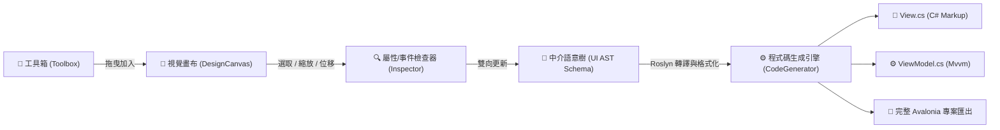

# Avalonia Form Generator (AFG)

> **視覺化拖曳式 Avalonia MVVM 介面與宣告式純 C# 程式碼生成工具**  
> 基於 **.NET 10**、**C# 14**、**Avalonia 11/12**、**CommunityToolkit.Mvvm** 與 **Microsoft.CodeAnalysis (Roslyn)** 打造。

---

## 📖 專案簡介 (Overview)

Avalonia UI 具備強大的跨平台特性與現代化的宣告式 UI 架構，但在傳統開發流程中缺乏直覺的「所見即所得 (WYSIWYG)」視覺化拖曳設計器。

**Avalonia Form Generator (AFG)** 旨在解決快速原型開發與表單密集型系統（如 CRUD 管理後台）的痛點，提供類似 WinForms 的直覺畫布拖曳、8 點縮放與智慧吸附輔助線，並將畫布操作同步至**中介語意樹 (UI Metadata AST)**，最終轉譯為**乾淨宣告式的純 C# Markup View** 與符合 **CommunityToolkit.Mvvm** 規範的 ViewModel 程式碼。



---

## ✨ 核心特色 (Key Features)

1. **視覺化設計畫布 (Design Canvas & Adorner System)**
   - **自由畫布與容器模式**：支援 Canvas 絕對座標排版與 Grid / StackPanel 流式佈局。
   - **8 點縮放控制裝飾器**：支援節點角落與四邊即時拉伸縮放、整體拖曳位移。
   - **智慧網格與邊界吸附 (`SnappingEngine`)**：提供 Snap to Grid 與節點間左/中/右、頂/中/底中心線即時對齊吸附。
   - **DOM 元件樹 (`VisualTreeExplorer`)**：階層式檢視目前畫布所有節點，即時連動選取狀態。

2. **屬性與事件檢查器 (`Property & Event Inspector`)**
   - **外觀與幾何屬性配置**：Text, Content, Watermark, Width/Height, Margins, Alignments, Opacity, IsEnabled 等。
   - **MVVM 視覺化綁定建構器 (`Binding Builder`)**：支援屬性雙向綁定 (TwoWay)、單向綁定 (OneWay) 與模式切換。
   - **事件轉命令 (`Event-to-Command Mapping`)**：自動將 Click / SelectionChanged 等事件映射為 RelayCommand。

3. **純 C# Markup 程式碼生成引擎 (`AFG.Generators`)**
   - **宣告式 C# UI 輸出**：採用鏈式方法調用 (Fluent Method Chaining) 遞迴生成現代 C# View。
   - **強型別 ViewModel**：基於 `CommunityToolkit.Mvvm`，自動生成帶有 `[ObservableProperty]` 與 `[RelayCommand]` 的 Partial Class。
   - **Roslyn 格式化與記憶體編譯診斷**：使用 Roslyn 語法樹標準化縮排，並在記憶體中編譯檢查，即時提供語法警告。
   - **整包專案匯出 (`ProjectExportService`)**：一鍵匯出完整獨立可編譯執行的 Avalonia .NET 10 模組專案。

4. **專案檔保存與載入 (`.afg.json`)**
   - 完整支援將設計中介語意樹序列化為 JSON 檔，方便團隊協同與二次編輯。

---

## 🏗️ 系統架構與專案結構 (Solution Architecture)

專案嚴格遵守 **模式 A (Avalonia UI 跨平台多專案分層結構)** 與 **SRP 單一職責原則**：

```
AvaloniaFormGenerator/
├── src/
│   ├── AFG.Core/                         # [核心核心層] UI AST 中介模型、不可變結構、純函數樹操作、驗證與 JSON 序列化
│   │   ├── Enums/                        # 控制項類型、佈局模式、綁定模式等列舉
│   │   ├── Models/Ast/                   # AstNode, FormDocument, BindingDefinition, EventMapping, AstTreeOperations
│   │   ├── Models/Common/                # ThicknessModel, CornerRadiusModel, GridLengthModel
│   │   ├── Serialization/                # AfgSerializer (.afg.json 專案檔讀寫)
│   │   └── Validation/                   # AstValidator (防禦性與命名規範檢查)
│   │
│   ├── AFG.Generators/                   # [程式碼生成引擎] Roslyn 格式化、C# Declarative View 生成、Mvvm 生成與專案匯出
│   │   ├── Abstractions/                 # ICodeGenerator, IRoslynCompilerService
│   │   ├── CSharpMarkup/                 # CSharpMarkupViewGenerator (Fluent 鏈式調用 View 生成器)
│   │   ├── Mvvm/                         # MvvmViewModelGenerator (自動屬性/命令提取與去重)
│   │   ├── ProjectExport/                # ProjectExportService (整包獨立專案匯出)
│   │   ├── Roslyn/                       # RoslynCodeFormatter, RoslynCompilerService
│   │   └── FormCodeGenerator.cs          # 生成器外觀服務
│   │
│   ├── AFG.Shared/                       # [跨平台共用 UI] 視覺畫布、8 點縮放裝飾器、對齊吸附、屬性檢查器
│   │   ├── Controls/                     # DesignCanvas (雙層渲染架構), SnappingEngine (吸附計算)
│   │   ├── Models/                       # ToolboxItem
│   │   ├── Services/                     # IFileDialogService, IClipboardService, ToolboxService
│   │   ├── ViewModels/                   # MainViewModel, CanvasViewModel, InspectorViewModel, ToolboxViewModel, VisualTreeViewModel
│   │   └── Views/                        # MainView, DesignCanvas, InspectorView, ToolboxView, VisualTreeExplorerView
│   │
│   └── AFG.Desktop/                      # [桌面端進入點] Windows/macOS/Linux 桌面宿主與本機平台 API 實作
│       ├── Services/                     # DesktopFileDialogService, DesktopClipboardService
│       ├── MainWindow.axaml / .cs        # 桌面主視窗
│       └── Program.cs                    # 應用程式進入點 (ClassicDesktopStyleApplicationLifetime)
│
├── tests/
│   ├── AFG.Core.Tests/                   # AST 增刪改查、循環防護、驗證器、序列化、吸附與檢查器測試 (32 項測試)
│   └── AFG.Generators.Tests/             # C# Markup 轉譯、ViewModel 生成、Roslyn 格式化與整包專案匯出測試 (10 項測試)
│
├── docs/                                 # 詳細技術與使用手冊
└── plan.md                               # 專案執行計劃書 (Phased Milestones)
```

---

## 🚀 快速開始 (Getting Started)

### 環境需求 (Prerequisites)
- [.NET 10 SDK](https://dotnet.microsoft.com/download/dotnet/10.0) 或更高版本。
- 支援的作業系統：Windows 10/11、macOS 12+、Linux (Ubuntu 22.04+ 等)。

### 1. 建置專案 (Build)
```bash
dotnet build
```

### 2. 執行單元測試 (Run Tests)
```bash
dotnet test
```
> 目前包含 **42 / 42** 項單元測試，100% 全數通過，0 警告，0 錯誤。

### 3. 啟動桌面設計器 (Run App)
```bash
dotnet run --project src/AFG.Desktop/AFG.Desktop.csproj
```

---

## 💻 C# Markup 程式碼生成範例 (Generated Code Example)

### 1. 產出的 View (純 C# Declarative UI)
```csharp
// <auto-generated />
#nullable enable

using System;
using Avalonia;
using Avalonia.Controls;
using Avalonia.Data;
using Avalonia.Layout;
using Avalonia.Media;

namespace GeneratedApp.Views;

public partial class LoginFormView : UserControl
{
    public LoginFormView()
    {
        InitializeComponent();
    }

    private void InitializeComponent()
    {
        Content = new Canvas()
            .Width(800)
            .Height(600)
            .Children(
                new TextBox()
                    .Width(240)
                    .Height(35)
                    .CanvasLeft(100)
                    .CanvasTop(80)
                    .PlaceholderText("請輸入使用者名稱")
                    .Text(nameof(LoginFormViewModel.Username), BindingMode.TwoWay),
                new Button()
                    .Width(120)
                    .Height(35)
                    .CanvasLeft(100)
                    .CanvasTop(130)
                    .Content("登入")
                    .Command(nameof(LoginFormViewModel.SubmitCommand))
            );
    }
}
```

### 2. 產出的 ViewModel (CommunityToolkit.Mvvm)
```csharp
// <auto-generated />
#nullable enable

using System;
using CommunityToolkit.Mvvm.ComponentModel;
using CommunityToolkit.Mvvm.Input;

namespace GeneratedApp.Views;

public partial class LoginFormViewModel : ObservableObject
{
    [ObservableProperty]
    private string _username = string.Empty;

    [RelayCommand]
    private void Submit()
    {
        // TODO: 實作命令業務邏輯
    }
}
```

---

## 📚 延伸說明文件 (Documentation)

請參閱 `docs/` 目錄下的詳細技術說明：
- [系統架構與資料流規格書](file:///D:/P/CS/Avalonia%20Form%20Generator/docs/architecture.md)
- [視覺化設計器操作手冊](file:///D:/P/CS/Avalonia%20Form%20Generator/docs/user-guide.md)
- [C# Declarative Markup 生成語法規範](file:///D:/P/CS/Avalonia%20Form%20Generator/docs/csharp-markup-spec.md)
- [UI AST Schema 規格與資料模型](file:///D:/P/CS/Avalonia%20Form%20Generator/docs/ast-schema.md)

---

## 📄 授權條款 (License)

本專案遵循 MIT License 授權協議。
