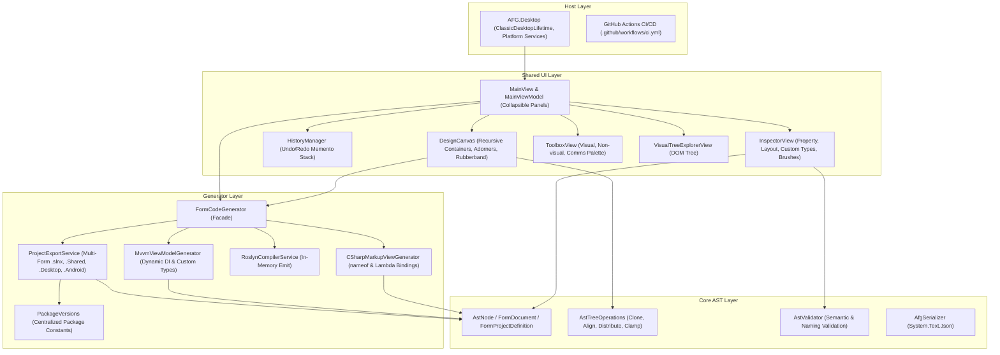
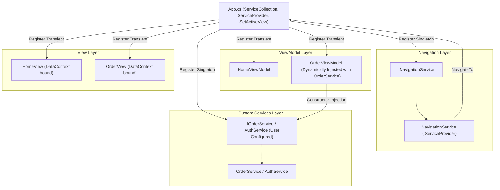
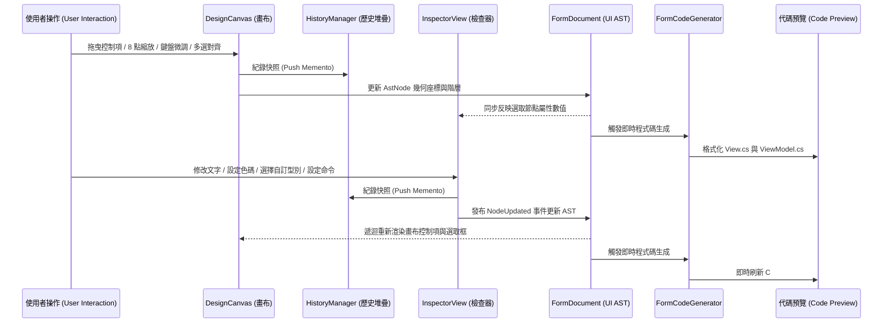

# 系統架構與技術規格書 (System Architecture Specification)

本文檔詳細說明 **Avalonia Form Generator (AFG)** 的分層架構、中介語意樹資料流、Roslyn 程式碼生成管線、相依性注入 (DI) 設計、多表單導航、復原重做歷史堆疊與跨平台宿主生成。

---

## 1. 核心設計哲學 (Design Principles)

1. **SRP 單一職責原則 (Separation of Concerns)**：
   - 核心 AST 語意樹 (`AFG.Core`) 為純 C# 資料模型，**零 UI 依賴**，可獨立於任何展示層進行序列化與測試。
   - 程式碼生成引擎 (`AFG.Generators`) 專注於 AST 轉譯、語法樹建構、DI 架構產出、強型別 Lambda 綁定與 Roslyn 編譯診斷。
   - 跨平台共用 UI (`AFG.Shared`) 負責畫布操作、手柄縮放、吸附對齊、多選均分、Undo/Redo 歷史堆疊、裝置解析度選擇與屬性檢查器。
   - 桌面宿主 (`AFG.Desktop`) 僅負責生命週期初始化與平台 API 注入（如檔案選擇器、剪貼簿）。

2. **不可變性與純函數式操作 (Immutability & Pure Functions)**：
   - AST 節點均宣告為不可變 `record`，樹狀節點的新增、刪除、複製、貼上、對齊、均分、座標限制皆由 `AstTreeOperations` 純函數完成，避免記憶體副作用。
   - 吸附計算由 `SnappingEngine` 純函數完成，易於進行極端邊界測試。
   - 復原/重做歷史堆疊由 `HistoryManager` 透過 Memento 快照模型管理。

3. **防禦性程式設計 (Fail-Fast)**：
   - 啟用 `<Nullable>enable</Nullable>`。
   - 公開 API 進入點全面使用 `ArgumentNullException.ThrowIfNull`。
   - 命名識別碼透過 `AstValidator` 進行 C# 正則與語意檢驗。
   - 檔案反序列化攔截結構化 `JsonException` 並提供行數與欄位提示。

---

## 2. 系統分層架構圖 (Layered Architecture)

---

## 3. 相依性注入 (DI) 與多表單導航架構設計

在產生的專案中，透過 `Microsoft.Extensions.DependencyInjection` 建立跨平台服務容器，並提供統一的 `INavigationService` 支援多表單視圖切換：

---

## 4. 資料流與狀態同步機制 (Data Flow)

AFG 採用「**以中介語意樹 (AST) 為單一真實來源 (Single Source of Truth)**」的反應式同步資料流：

---

## 5. 模組職責明細

| 專案模組 | 職責劃分 | 關鍵類別 |
| :--- | :--- | :--- |
| **`AFG.Core`** | UI AST 節點定義、多表單專案定義、表單與視窗控制屬性系統 (`WindowStartupLocation`, `WindowState`, `SystemDecorations`)、多參數事件規格 (`EventParameterDefinition`)、控制項與對話方塊專屬事件目錄 (`ControlEventCatalog`)、純函數樹操作（遞迴複製、對齊、均分、限制邊界、容器子節點重排）、驗證與 JSON 序列化 | `AstNode`, `FormDocument`, `FormProjectDefinition`, `EventMappingDefinition`, `EventParameterDefinition`, `ControlEventCatalog`, `AstTreeOperations`, `AstValidator`, `AfgSerializer` |
| **`AFG.Generators`** | C# Declarative UI 程式碼生成（物件名稱註解、支援 nameof 與 Lambda 編譯綁定、原生事件轉發 `OnClick` / `OnTextChanged` 等、UserControl 根背景與尺寸套用）、PictureBox Bitmap 初始化與相對資源路徑 (`avares://`) 生成、CommunityToolkit.Mvvm 多參數 ValueTuple 安全生成、對話方塊跨平台服務 (`IDialogService`, `DialogService`, `MessageBoxWindow`)、視窗啟動與全域組態 (`App.cs`, `Config.cs`) 生成、動態 DI 生成、版本常數管理、Roslyn 格式化、多表單專案匯出與實體 Assets 自動複製 | `CSharpMarkupViewGenerator`, `MvvmViewModelGenerator`, `AvaloniaMarkupExtensionsSource`, `PackageVersions`, `RoslynCompilerService`, `ProjectExportService` |
| **`AFG.Shared`** | 視覺畫布（遞迴容器、橡皮筋框選、容器拖曳重排指示線、不可視與對話方塊元件徽章卡片、PictureBox 實體圖片預覽與 Bitmap 初始化視覺、畫布背景色即時渲染、差量更新演算法 `TryPatchElements`）、8 點縮放裝飾器、對齊吸附計算、裝置解析度模型、可摺疊面板排版、歷史堆疊、屬性檢查器（表單/控制項模式切換、視窗外觀/尺寸/行為屬性編輯面板、色碼輸入與色票快捷列、視窗圖示選擇、焦點保護、專屬事件與型別過濾、參數去重、圖片檔案對話框瀏覽）、`BitmapHelper` / `BitmapExtensions`、`CSharpSyntaxColorizer` (VS Code Dark+ 語法高亮)、`SelectableTextBlock` | `DesignCanvas`, `HistoryManager`, `SnappingEngine`, `CanvasPreset`, `MainViewModel`, `InspectorViewModel`, `CanvasViewModel`, `BitmapHelper`, `BitmapExtensions`, `CSharpSyntaxColorizer` |
| **`AFG.Desktop`** | Windows/macOS/Linux 桌面應用程式進入點、最大化視窗啟動與本機平台服務 | `Program`, `MainWindow`, `DesktopFileDialogService`, `DesktopClipboardService` |
