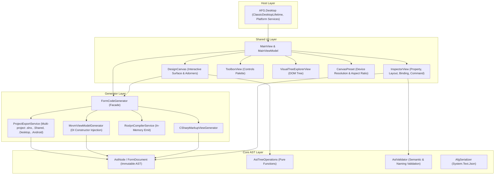
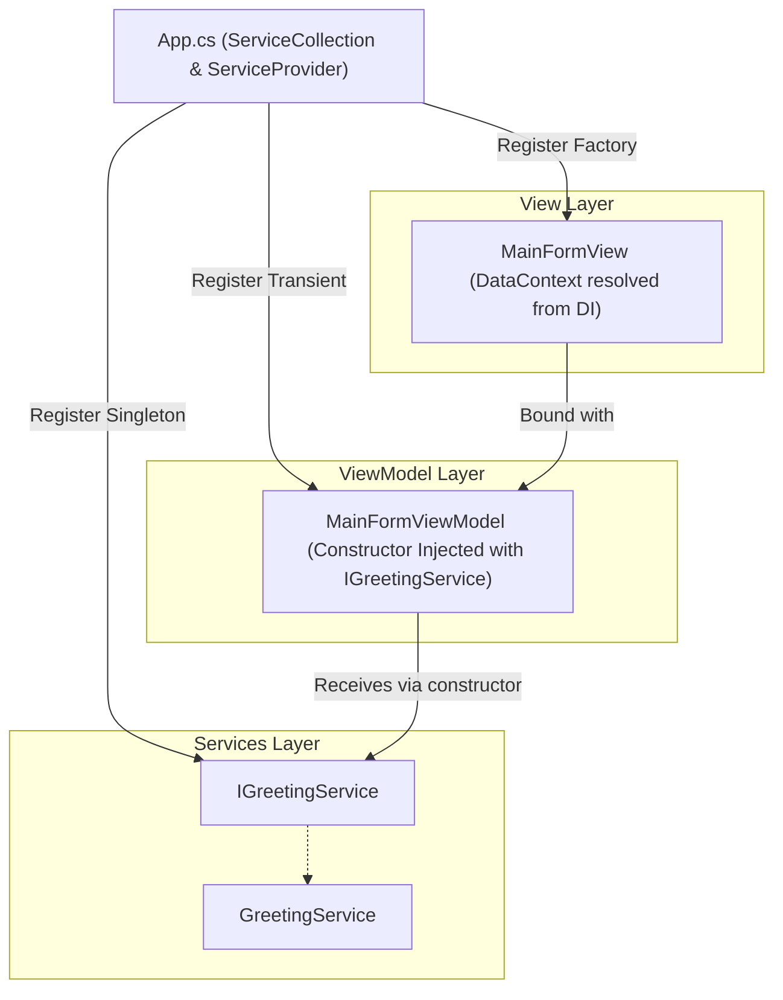
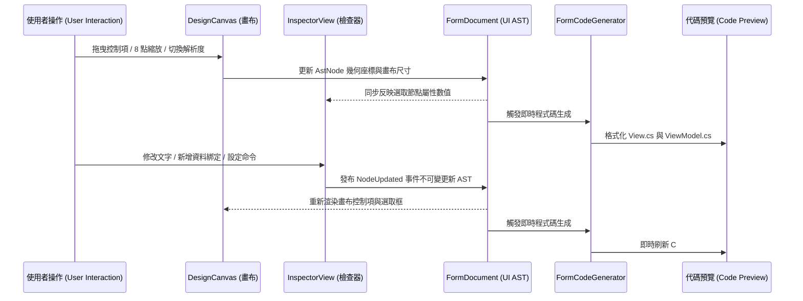

# 系統架構與技術規格書 (System Architecture Specification)

本文檔詳細說明 **Avalonia Form Generator (AFG)** 的分層架構、中介語意樹資料流、Roslyn 程式碼生成管線、相依性注入 (DI) 設計與跨平台宿主生成。

---

## 1. 核心設計哲學 (Design Principles)

1. **SRP 單一職責原則 (Separation of Concerns)**：
   - 核心 AST 語意樹 (`AFG.Core`) 為純 C# 資料模型，**零 UI 依賴**，可獨立於任何展示層進行序列化與測試。
   - 程式碼生成引擎 (`AFG.Generators`) 只關注 AST 轉譯、語法樹建構、DI 架構產出與 Roslyn 編譯診斷。
   - 視覺設計器 UI (`AFG.Shared`) 專注於畫布操作、手柄縮放、吸附對齊、裝置解析度選擇與屬性互動。
   - 桌面宿主 (`AFG.Desktop`) 僅負責生命週期初始化與平台 API 注入（如檔案選擇器、剪貼簿）。

2. **不可變性與純函數式操作 (Immutability & Pure Functions)**：
   - AST 節點均宣告為不可變 `record`，樹狀節點的新增、刪除、移動、更新皆由 `AstTreeOperations` 純函數完成，避免記憶體副作用。
   - 吸附計算由 `SnappingEngine` 純函數完成，易於進行極端邊界測試。

3. **防禦性程式設計 (Fail-Fast)**：
   - 啟用 `<Nullable>enable</Nullable>`。
   - 公開 API 進入點全面使用 `ArgumentNullException.ThrowIfNull`。
   - 命名識別碼透過 `AstValidator` 進行 C# 正則與語意檢驗。

---

## 2. 系統分層架構圖 (Layered Architecture)

---

## 3. 相依性注入 (DI) 架構設計

在產生的專案中，透過 `Microsoft.Extensions.DependencyInjection` 建立跨平台服務容器：

---

## 4. 資料流與狀態同步機制 (Data Flow)

AFG 採用「**以中介語意樹 (AST) 為單一真實來源 (Single Source of Truth)**」的反應式同步資料流：

---

## 5. 模組職責明細

| 專案模組 | 職責劃分 | 關鍵類別 |
| :--- | :--- | :--- |
| **`AFG.Core`** | UI AST 節點定義、排版結構模型、純函數樹操作、驗證與 JSON 序列化 | `AstNode`, `FormDocument`, `AstTreeOperations`, `AstValidator`, `AfgSerializer` |
| **`AFG.Generators`** | C# Declarative UI 程式碼生成、CommunityToolkit.Mvvm 與 DI 生成、Roslyn 格式化、跨平台多專案匯出 | `CSharpMarkupViewGenerator`, `MvvmViewModelGenerator`, `RoslynCompilerService`, `ProjectExportService` |
| **`AFG.Shared`** | 視覺畫布、8 點縮放裝飾器、對齊吸附計算、裝置解析度模型、工具箱、DOM 樹與屬性檢查器 | `DesignCanvas`, `SnappingEngine`, `CanvasPreset`, `MainViewModel`, `InspectorViewModel`, `CanvasViewModel` |
| **`AFG.Desktop`** | Windows/macOS/Linux 桌面應用程式進入點與本機對話框/剪貼簿平台服務 | `Program`, `MainWindow`, `DesktopFileDialogService`, `DesktopClipboardService` |
